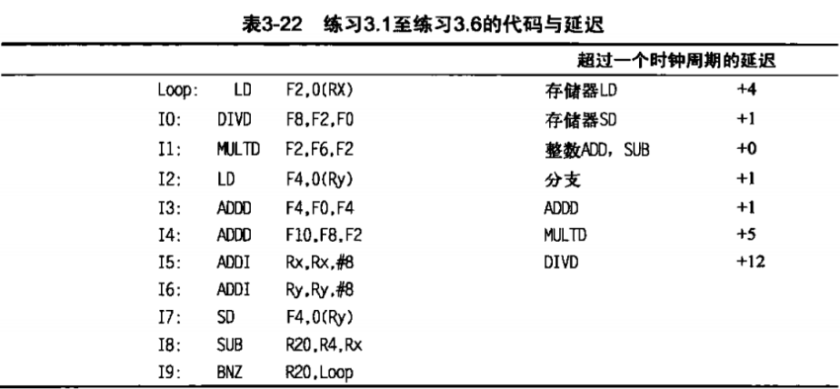
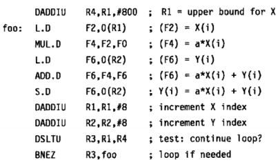
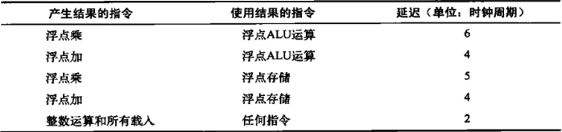
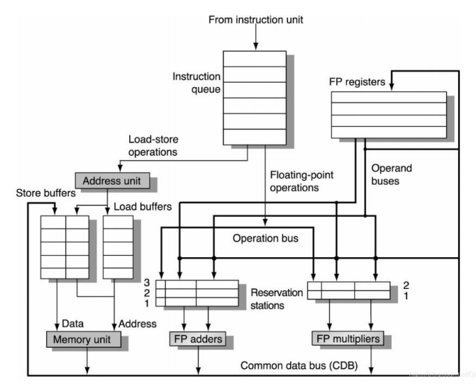
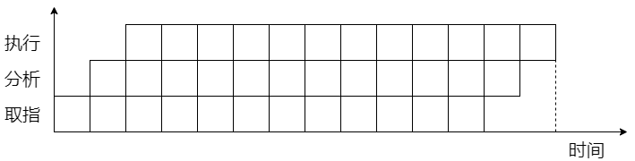
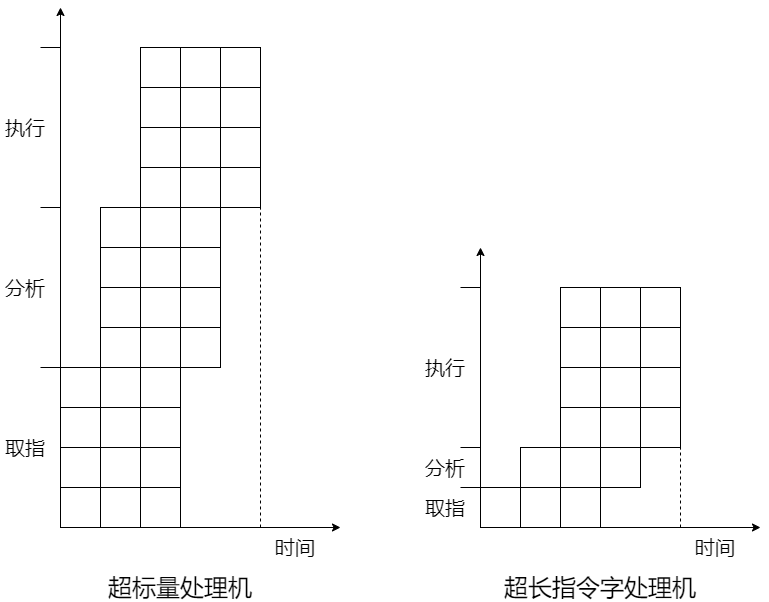

# 体系结构第四次作业

## 第一题 3.2 [10]< 1.8、3.1、3.2 >

思考一下延迟数目到底意味着什么一一它们表示一个给定函数生成其输出结果所需要的时钟周期数，没有别的意思。如果整个流水线在每个功能单元的延迟周期中停顿，那么至少要保证任何一对“背靠背" 指令（生成结果的指令后面紧跟着使用结果的指令）正确执行。但并非所有指令对具有这种“生成者/使用者”的关系。有时，两条相邻指令之间没有任 何关系。如果流水线检测到真正的数据相关，而且只会因为这些真数据相关而停顿，而不会仅仅因为有某个功能单元繁忙就盲目停顿, 那表 3-22 代码序列中的循环体需要多少个时钟周期? 在代码中需要容纳所述延迟的时候插入< sta11 >。（提示：延迟为+2 的指令需要在代码序列中插入两个< stall >时钟周期。可以这样来考虑：一条需要一个时钟周期的指令的延迟为 1+0，也就是不需要额外的等待状态。那么延迟 $1+1$ 就意味着 1 个停顿周期，延迟 $1+N$ 有 $N$ 个额外停顿 周期。



**解答：**需要25个周期。插入< stall >后的指令序列如下

```
LOOP:	LD			F2,0(Rx)
		<stall>
		<stall>
		<stall>
		<stall>
		DIVD		F8,F2,F0
		MULTD		F2,F6,F2
		LD			F4,0(Ry)
		<stall>
		<stall>
		<stall>
		<stall>
		ADDD		F4,F0,F4
		<stall>
		<stall>
		<stall>
		<stall>
		<stall>
		ADDD		F10,F8,F2
		ADDI		Rx,Rx,#8
		ADDI		Ry,Ry,#8
		SD			F4,0(Ry)
		SUB			R20,R4,Rx
		BNZ			R20,Loop
```


## 第二题 3.14 [25 / 25 / 25]<3.2、3.7>

在这个练习中，我们研究如何利用软件技术从一个常见的向量循环中提取指令级并行（ILP）。下面的循环是所谓的 DAXPY 循环（双精度 $\mathrm{a} \mathrm{X}$ 加 $Y$ )，它是高斯消元法的核心运算。下面的代码实现 DAXPY 运算 $Y=a X+Y$, 向量长度为 100 。最初，R1 被设置为数组 $X$ 的基地址，R2 被设置为 $Y$ 的基地址：



假定功能单元的延迟如下表所示。假定在 ID 阶段解决一个延迟为 1 周期的分支。假定结果被完全旁路。



### **a.** [25]< 3.2 >

假定一个单发射流水线。说明在编译器未进行调度以及对浮点运算和分支延迟进行调度之后，该循环是什么样的，包括所有停顿或空闲时间周期。在未调度和已调度情况 下，结果向量 Y 中每个元素的执行时间为多少个时钟? 为使处理器硬件独自匹配调度编译器所实现的性能改进，时钟频率应当为多少? ( 忽略加快时钟速度会对存储器系统性能产生的影响。） 

**解答：**此处假设有一个延迟槽，于是未做调度时，19个时钟

```
		DADDIU		R4,R1,#800
foo:	L.D			F2,0(R1)
		<stall>
		MUL.D		F4,F2,F0
		L.D			F6,0(R2)
		<stall>
		<stall>
		<stall>
		<stall>
		ADD.D		F6,F4,F6
		<stall>
		<stall>
		<stall>
		S.D			F6,0(R2)
		DADDIU		R1,R1,#8
		DADDIU		R2,R2,#8
		DSLTU		R3,R1,R4
		<stall>
		BNEZ		R3,foo
		<stall>
```

同样假定有一个延迟槽，那么由编译器调度后为13个时钟

```
		DADDIU		R4,R1,#800
foo:	L.D			F2,0(R1)
		L.D			F6,0(R2)
		MUL.D		F4,F2,F0
		DADDIU		R1,R1,#8
		DADDIU		R2,R2,#8
		DSLTU		R3,R1,R4
		<stall>
		<stall>
		ADD.D		F6,F4,F6
		<stall>
		<stall>
		BNEZ		R3,foo
		S.D			F6,-8(R2)
```

此处题意若理解为让CPU追平编译器的优化以同步，那么此处调度的加速比为 $ 19/13 \approx 1.46 $，所以频率需要增加 $46\%$。


### b. [25]< 3.2 >

假定一个单发射流水线。根据需要对循环进行任意次展开，使调度中不存在任何停顿，消除循环开销指令。必须将此循环展开多少次？给出指令调度。结果中每个元素的执行时间为多少？sss

**解答：**展开三次，每个元素平均约 $19/3$ 个时钟周期

```
		DADDIU		R4,R1,#800
foo		L.D			F2,0(R1)
		L.D			F6,0(R2)
		MUL.D		F4,F2,F0
		L.D			F2,8(R1)
		L.D			F10,8(R2)
		MUL.D		F8,F2,F0
		L.D			F2,16(R1)
		L.D			F14,16(R2)
		MUL.D		F12,F2,F0
		ADD.D		F6,F4,F6
		DADDIU		R1,R1,#24
		ADD.D		F10,F8,F10
		DADDIU		R2,R2,#24
		DSLTU		R3,R1,R4
		ADD.D		F14,F12,F14
		S.D			F6,-24(R2)
		S.D			F10,-16(R2)
		BNEZ		R3,foo
		S.D			F14,-8(R2)
```


## 第三题



如图所示，假设浮点加法执行需要 2 个周期，浮点乘法需要 3 个周期，功能单元完全流水化。采用 Tomasulo 算法运行下列指令，写出第 7 个周期 Reservation Stations 和 Register result status 的状态。

```
ADD.D F4,F0,F8
MULT.D F2,F0,F4
ADD.D F4,F4,F8
MULT.D F8,F4,F2
```

**解答：**罗列如下

$Reservation\ Status$

| Time | Name        | Busy | Op     | $V_j$   | $V_k$ | $Q_j$ | $Q_k$       |
| ---- | ----------- | ---- | ------ | ------- | ----- | ----- | ----------- |
|      | Adder1      |      |        |         |       |       |             |
|      | Adder2      |      |        |         |       |       |             |
|      | Adder3      |      |        |         |       |       |             |
| 0    | Multiplier1 | Yes  | MULT.D | R(F0)   | (R+R) |       |             |
|      | Multiplier2 | Yes  | MULT.D | (R+R+R) |       |       | Multiplier1 |

$Register\ result\ status$

|      | F0   | F2          | F4      | F6   | F8          |
| ---- | ---- | ----------- | ------- | ---- | ----------- |
| FU   |      | Multiplier1 | (R+R+R) |      | Multiplier2 |


## 第四题 3.19 [10/5]<3.9>

考虑分支目标缓冲区​，正确条件分支预测、错误预测和缓存缺失的代价分别为 0、2 和 2 个时钟周期。考虑一种区分条件与无条件分支的分支目标缓计区设计，而条件分支存储目标地址，对于无条件分支则存储目标指令。

### a.[10]<3.9>

当缓冲区中发现无条件分支时，代价为多少个时钟周期？

**解答：**若缺失，代价就是该缓冲区缺失后换入的代价，相反如果命中了无条件分支所存储的目标指令，那么就可以直接将其取出进行译码，反而在性能上优化了一个周期。


### b.[10]<3.9>

判断对于无条件分支进行分支折合所获得的改进。假定命中率为 $90 \%$, 无条件分支频率为 $5 \%$ ，缓冲区缺失的代价为两个时钟周期。这样可以获得多少改进? 对于这一改进来说，必须达到多高的命中率才能提供性能增益?

**解答：**改进为 $5\% \times (90\% \times (-1) + (1-90\%) \times 2 = -0.035$ ，也就是说，其优化了 0.035 的 CPI 。

解不等式 $5\% \times (a \times (-1) + (1-a)\times 2) < 0$ 得 $a > 2/3 \approx 66.7\%$ ，至少要达到 $66.7\%$ 的命中率。


## 第五题

设指令流水线由取指令、分析指令和执行指令 3 个部件构成，每个部件经过的时间为 $ \Delta t $ ，连续流入 12 条指令。分别画出标量流水处理机以及 ILP 均为 4 的超标量处理机、超长指令字处理机的时空图，并分别计算它们相对于标量流水处理机的加速比。

**解答：**绘制时空图

标量流水处理机：



超标量处理机和超长指令字处理机：



加速比均为 $14\Delta t / 5\Delta t = 2.8$ 。

